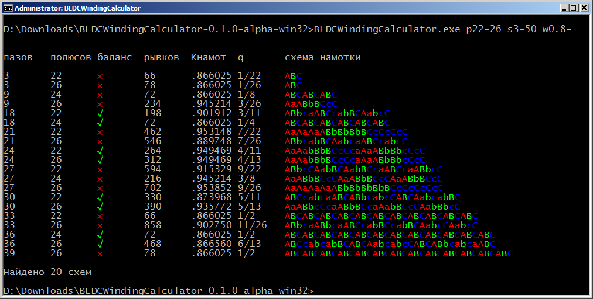
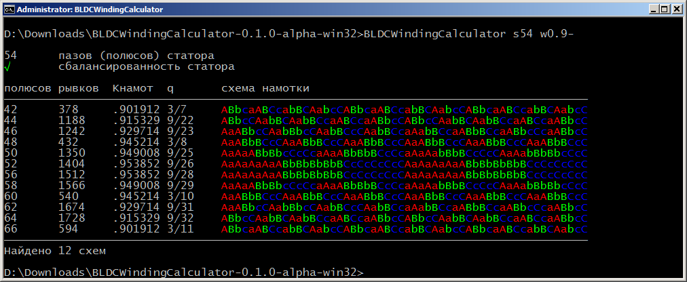
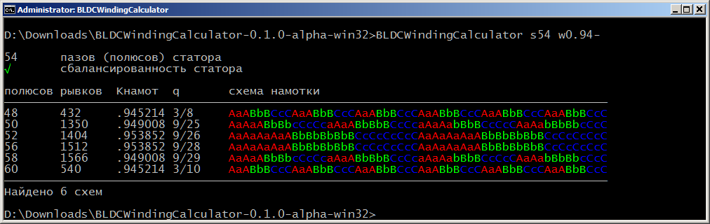
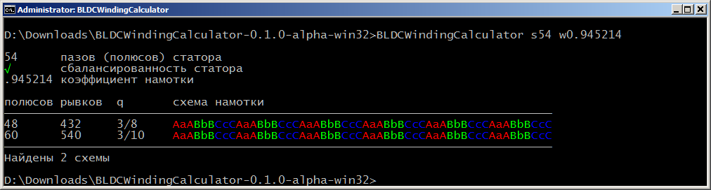

# BLDCWindingCalculator

Программа для поиска схем намотки многополюсных BLDC моторов с сосредоточенными обмотками.
Параметры для поиска можно задать в виде диапазонов.
В отличии от всем известной *баварии* и ей подобным, которые просто выдают одну схему намотки
и на этом всё, эта программа способна перебирать варианты (причём *очень быстро*, C++ рулит) и
выдать *список* схем, подходящих по параметрам.

## Пример использования

Вводим в командной строке:
```shell
BLDCWindingCalculator p22-26 s3-50 w0.8-
```

Что значит: а поищи-ка нам все варианты схем где полюсов ротора от 22 до 26, пазов в статоре от 3 до 50
и чтоб коэффициент намотки (winding factor) был больше 0.8



## Ещё пример использования
Представим, в неком моторе Вы решили заменить магниты (старые перегрелись, заржавели, итд, их было 60).
Его статор имеет 54 паза. Можно ли поменять количество магнитов?
Можно ли будет обойтись без перемотки?

Вводим в командной строке:
```shell
BLDCWindingCalculator s54 w0.9-
```
что значит: искать схемы с количеством пазов 54 и коэффициентом намотки
(winding factor) больше 0.9



чё-то много, ужесточим, пусть коэффициент намотки будет больше 0.94
(чтоб старая схема в список тоже попадала)
```shell
BLDCWindingCalculator s54 w0.94-
```



а что если поставить коэффициент намотки точно 0.945214, как у старой схемы
```shell
BLDCWindingCalculator s54 w0.945214
```



Вот и ответ: если не менять схему намотки, то кроме старой схемы на 60 магнитов
можно использовать схему на 48. Эффективность обеих схем будет одинаковой.

## Установка и запуск

- под Windows

В правой части экрана, нажимите на заглавие раздельчика
[Releases](https://github.com/dmitry-lyzin/BLDCWindingCalculator/releases),
скачайте архив `BLDCWindingCalculator-0.1.0-alpha-win32.zip`, жмёте правую кнопку мыши на нем,
выбираете `Извлечь всё...`, нажимаете кнопку `Извлечь`, рядом с архивом появится папка
`BLDCWindingCalculator-0.1.0-alpha-win32` заходите в неё и запускайте `BLDCWindingCalculatorForNoob`
(это cmd-файл), фух, кажется всё объяснил.  
Если Вы знаете что такое командная строка - просто запускайте `BLDCWindingCalculator.exe`.
Если вы собираетесь положить exe'шник в папку, которая в *путях*, то не забудьте положить туда-же
папку `locale`, иначе все сообщения программы будут на английском.

- под linux/unix всё просто:
```shell
git clone https://github.com/dmitry-lyzin/BLDCWindingCalculator.git
cd BLDCWindingCalculator
make
sudo make install
```

## Опции запуска

<dl>
<dt><b>s˂диапазон˃</b></dt><dd>указываем количество пазов статора, можно в виде диапазона</dd>
<dt><b>p˂диапазон˃</b></dt><dd>указываем количество магнитных полюсов ротора, то-же можно в виде диапазона</dd>
<dt><b>b[+|-|any]</b></dt><dd><code>+</code> - искать только сбалансированные (симметричные) статоры,
<code>-</code> - несбалансированные (несимметричные). Если эту опцию указать с аргументом <code>a</code>,
или вообще эту опцию не указать, то программа будет считать подходящими любые статоры.</dd>
<dt><b>c˂диапазон˃</b></dt><dd>количество пульсаций (cogging steps) момента вращения на 1 оборот, то-же можно в виде диапазона</dd>
<dt><b>w˂диапазон˃</b></dt><dd>коэффициент намотки (winding factor). Диапазон от 0 до 1. Чем ближе он к 1 - тем лучше.
Но это в идеале. А на практике - если больше 0.9 то очень хорошо.</dd>
<dt><b>q˂диапазон˃</b></dt><dd>число пазов на полюс и фазу (q). Диапазон от 0 до 1. В идеале: 0.3333 (1/3). Более-менее
практичный интервал 0.3-0.42</dd>
<dt><b>h</b></dt><dd>выдать краткую подсказку и сдохнуть</dd>
</dl>

### Аргументы опций

<dl>
<dt><b>˂диапазон˃</b></dt>
<dd>это пара чисел через знак <code>-</code>, в ней первое или второе или даже оба числа можно опустить
(будет один <code>-</code>) или указать одно (типа диапазон из одного числа)</dd>
</dl>

## Как связаться с автором

Если у вас есть какие-нибудь комментарии или передложения, или вообще хочеться сказать что-нибудь умное,
то пишите мне на почту, я её иногда читаю:  
Дмитрий Лызин <dmitry_lyzin@mail.ru>
