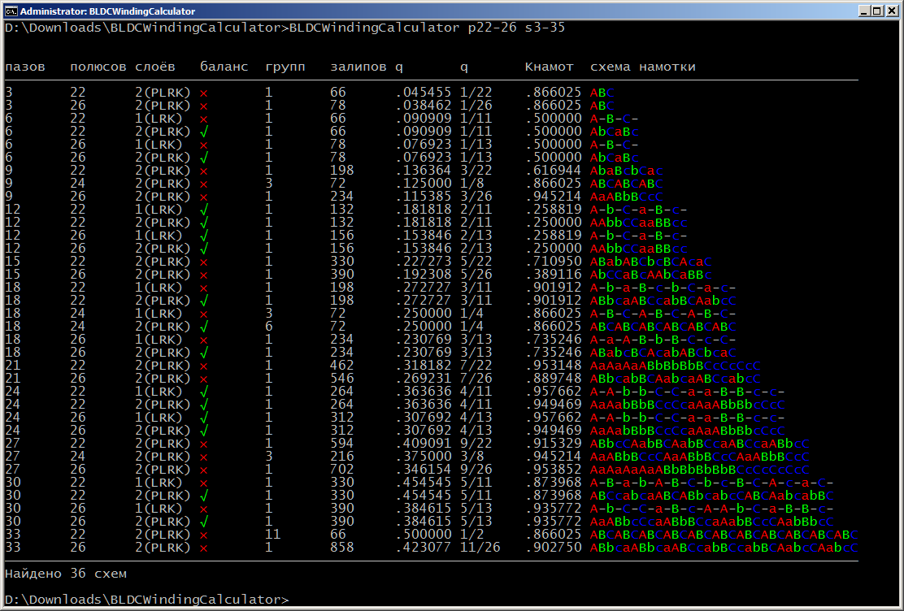
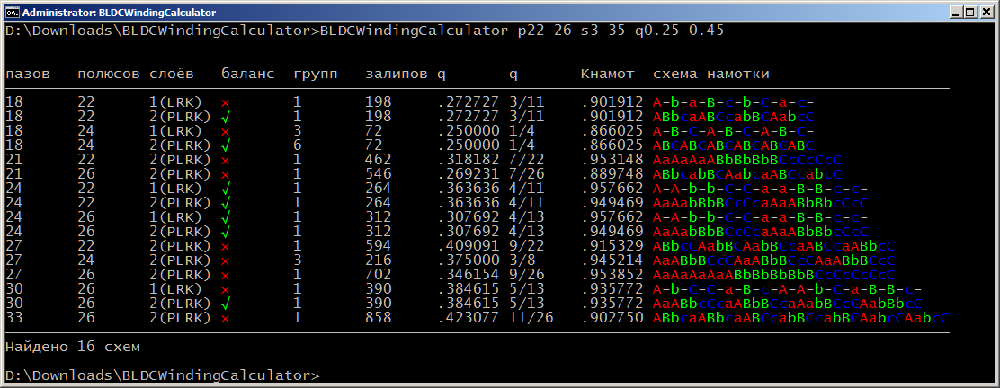
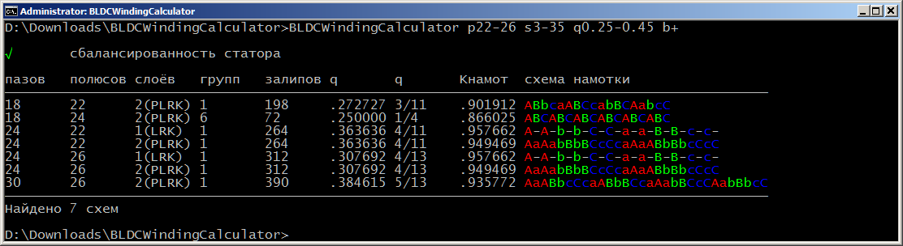
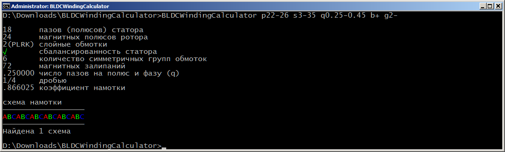

# BLDCWindingCalculator

Программа для поиска схем намотки многополюсных BLDC моторов с сосредоточенными обмотками.
Параметры для поиска можно задать в виде диапазонов.
В отличии от всем известной *баварии* и ей подобным, которые просто выдают одну схему намотки
и на этом всё, эта программа способна перебирать варианты (причём *очень быстро*, C++ рулит) и
выдать *список* схем, подходящих по параметрам.

## Пример использования

Вводим в командной строке:
```shell
BLDCWindingCalculator p22-26 s3-35
```
Что значит: а поищи-ка нам все варианты схем где полюсов ротора от 22 до 26, а пазов в статоре от 3 до 35



Расшифровка схем

> Вот этих вот цветных буковок.  
> Каждая буква в схеме соответствует обмотке вокруг зубца статора.
> Буква обозначает фазу, регистр буквы - направление намотки.
> Таким образом: `A` - фаза A, зуб статора обматывается по часовой стрелке,
> `a` - тоже фаза A, но зуб статора обматывается против часовой.
> Точно так-же и с `B` - `b` и с `C` - `c`.  
> В некоторых схемах буквы разделены `-`. Это однослойная или "через зуб" или LRK намотка.

Схемы с маленьким соотношением пазов и полюсов на фазу *(q = s/(3p))* малоэффективны: над одним зубцом
статора оказывается *несколко* магнитов ротора и они просто не работают, работает только один,
оказавшийся на краю зубца. Из этого следует, что *q* нужно держать в районе 1/3 или 0.33333,
мы зададим интервал от 0.25 до 0.45 (опция `q0.25-0.45`).  
Введём:
```shell
BLDCWindingCalculator p22-26 s3-35 q0.25-0.45
```


Отбросим все схемы с несимметричным полем (опция `b+`). Такое поле постоянно тянет ротор в бок. Для мотора какого-нибудь
моноколеса это не важно - его и так всё время куда-то тянет, так что одной силой больше, одной меньше... А вот для моторчика
дрона - важно, он пропеллером в воздухе молотит и любой дисбаланс - губителен.
```shell
BLDCWindingCalculator p22-26 s3-35 q0.25-0.45 b+
```


Отберём схемы в которых обмотки идут повторяющимеся группами, с осевоыми симметриями.
Возьмём все схемя где этих групп две и больше (опция `g2-`)

```shell
BLDCWindingCalculator p22-26 s3-35 q0.25-0.45 b+ g2-
```


Всего одна схема. Вот так интересно получается...

## Установка и запуск

- под Windows

В правой части экрана, нажимите на заглавие раздельчика
[Releases](https://github.com/dmitry-lyzin/BLDCWindingCalculator/releases),
скачайте архив `BLDCWindingCalculator-0.2.0-alpha-win32.zip`, жмёте правую кнопку мыши на нем,
выбираете `Извлечь всё...`, нажимаете кнопку `Извлечь`, рядом с архивом появится папка
`BLDCWindingCalculator-0.2.0-alpha-win32` заходите в неё и запускайте `BLDCWindingCalculatorForNoob`
(это cmd-файл), фух, кажется всё объяснил.  
Если Вы знаете что такое командная строка - просто запускайте `BLDCWindingCalculator.exe`.
Если вы собираетесь положить exe'шник в папку, которая в *путях*, то не забудьте положить туда-же
папку `locale`, иначе все сообщения программы будут на английском.

- под linux/unix всё просто:
```shell
git clone https://github.com/dmitry-lyzin/BLDCWindingCalculator.git
cd BLDCWindingCalculator
make
sudo make install
```

## Опции запуска

<dl>
<dt><b>s˂диапазон˃</b></dt><dd>указываем количество пазов статора, можно в виде диапазона</dd>
<dt><b>p˂диапазон˃</b></dt><dd>указываем количество магнитных полюсов ротора, то-же можно в виде диапазона</dd>
<dt><b>b[+|-|any]</b></dt><dd><code>+</code> - искать только сбалансированные (симметричные) статоры,
<code>-</code> - несбалансированные (несимметричные). Если эту опцию указать с аргументом <code>a</code>,
или вообще эту опцию не указать, то программа будет считать подходящими любые статоры.</dd>
<dt><b>c˂диапазон˃</b></dt><dd>количество пульсаций (cogging steps) момента вращения на 1 оборот, то-же можно в виде диапазона</dd>
<dt><b>w˂диапазон˃</b></dt><dd>коэффициент намотки (winding factor). Диапазон от 0 до 1. Чем ближе он к 1 - тем лучше.
Но это в идеале. А на практике - если больше 0.9 то очень хорошо.</dd>
<dt><b>q˂диапазон˃</b></dt><dd>число пазов на полюс и фазу (q). Диапазон от 0 до 1. В идеале: 0.3333 (1/3). Более-менее
практичный интервал 0.3-0.42</dd>
<dt><b>l˂диапазон˃</b></dt><dd>количество сторон катушек в каждом слоте. Диапазон от 1 до 2. Значение 2 - катушки располагаются
на каждом зубце статора, 1 - через зубец.</dd>
<dt><b>g˂диапазон˃</b></dt><dd>количество вращательных симметрий (повторяющихся групп) в конструкции обмотки статора электромотора</dd>
<dt><b>h</b></dt><dd>выдать краткую подсказку и сдохнуть</dd>
</dl>

### Аргументы опций

<dl>
<dt><b>˂диапазон˃</b></dt>
<dd>это пара чисел через знак <code>-</code>, в ней первое или второе или даже оба числа можно опустить
(будет один <code>-</code>) или указать одно (типа диапазон из одного числа)</dd>
</dl>

## Код возврата

По-скольку это утилита командной строки, и её можно вставлять в свои сценарии, у неё есть код возврата.
В качестве кода возврата возвращается количество найденых схем намотки.
И когда ничего не нашли - код возврата будет 0, что немного контринтуитивно для утилит командной строки.

## Как связаться с автором

Если у вас есть какие-нибудь комментарии или передложения, или вообще хочеться сказать что-нибудь умное,
то пишите мне на почту, я её иногда читаю:  
Дмитрий Лызин <dmitry_lyzin@mail.ru>
