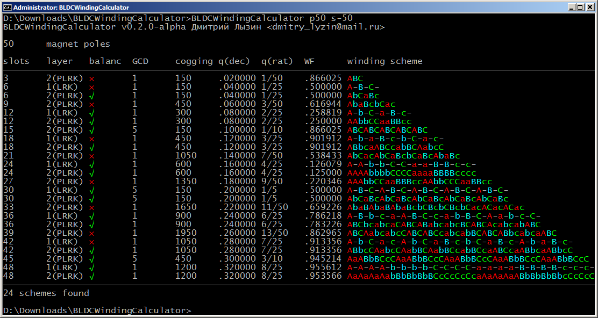
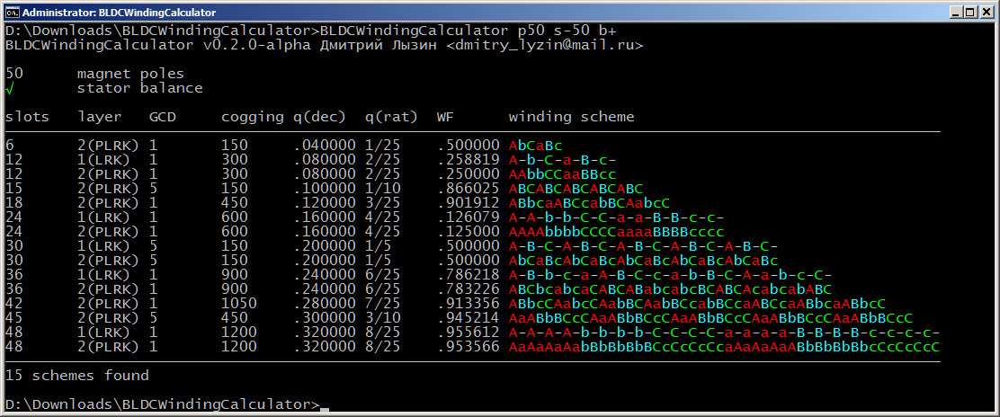
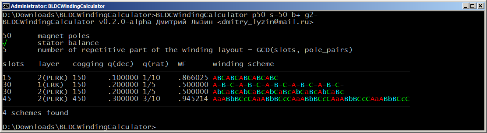
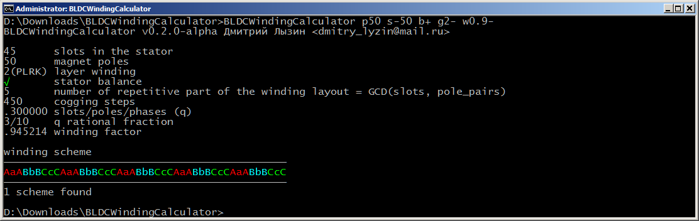

[](readme_ru.md)

---


# BLDC Winding Calculator

This command-line utility is designed to find the winding layout, winding factor,
number of number of winding symmetries, cogging steps per turn, number of winding layers, etc.
for your electric motor with the concentrated winding (so far).
The search parameters can be set as ranges.
Unlike the well-known *Bavaria* (peace be upon her) and the like,
which simply find one winding scheme and that's it,
this program is able to sort through the options and output a *list* of schemes
corresponding to the specified parameters.

## ⌨️ Usage example

Type in the command prompt:
```shell
BLDCWindingCalculator p50 s-50
```
What this means: look for all possible schemes where there are 50 rotor poles
and from 3 to 50 slots in the stator.



📌 Decoding Winding layout the schemes

> This designation scheme came from aircraft modeling.
> The phases are noted `Aa` for the first phase, `Bb` for the second phase, and `Cc` for the third phase.
> The capitalization indicates the conductor orientation: upper-case letters `A`, `B`, `C`
> for the conductors in one direction and lower-case letters `a`, `b`, `c` for the return conductors.
> If the letters are separated by -, then this is a winding "through the tooth" or single-layer or LRK.

We will discard all schemes with an asymmetric field (option `b+`).
Such a field constantly pulls the rotor sideways. We don't need that.
```shell
BLDCWindingCalculator p50 s-50 b+
```


Let's select schemes in which the windings run in repetitive groups, with axial symmetries.
Let's take all the schemes where there are two or more of these groups (option `g2-`).
```shell
BLDCWindingCalculator p50 s-50 b+ g2-
```


Let's choose schemes in which the winding factor is greater than 0.9 (option `w0.9-`).
```shell
BLDCWindingCalculator p50 s-50 b+ g2- w0.9-
```


## 🛠️ Installing and running

- ♻️ Windows

[Releases](https://github.com/dmitry-lyzin/BLDCWindingCalculator/releases/latest)
contain precompiled exe binarie for Windows 32 architecture.
Download the `BLDCWindingCalculator-0.3.0-alpha-win32.zip` archive from there,
right-click on it, select `Extract all...`, click `Extract`,
the folder `BLDCWindingCalculator-0.3.0-alpha-win32`
will appear next to the archive, go into it and run (double-click)
`BLDCWindingCalculatorForNoob` (this is a cmd file, it will help you).  
If you know what a command prompt is, just run `BLDCWindingCalculator.exe`.
You can put the exe file in the folder that is in the *paths*.

- 🐧 Linux & Unix
```shell
git clone https://github.com/dmitry-lyzin/BLDCWindingCalculator.git
cd BLDCWindingCalculator
make
sudo make install
make clean
```

## ✨ Option

<dl>
<dt><code>s˂range˃</code></dt><dd>specify the number of stator slots, optionally as a range</dd>
<dt><code>p˂range˃</code></dt><dd>specify the number of rotor magnetic poles, which can also be specified as a range</dd>
<dt><code>b[+|-|any]</code></dt><dd><code>+</code> - search only for balanced (symmetrical) stators,
<code>-</code> - for unbalanced (asymmetrical) stators. If you specify this option with the argument <code>a</code>,
or do not specify it at all, the program will consider any stators to be suitable.</dd>
<dt><code>c˂range˃</code></dt><dd>Cogging steps. This value is the lowest number that is a multiple of both
the number of poles and the number of slots. It is an indicator for what levels of cogging torque
one can expect. Range from 1 to ∞.</dd>
<dt><code>w˂range˃</code></dt><dd>The winding factor for a specific winding expresses the ratio of flux
linked by that winding compared to flux that would have been linked by a single-layer full-pitch
non-skewed integer-slot winding with the same number of turns and one single slot per pole per phase.
The torque of an electric motor is proportional to the fundamental winding factor. Range from 0 to 1.</dd>
<dt><code>q˂range˃</code></dt><dd>The number of slots per pole per phase <i>(q)</i> determines how the winding layout is arranged.
It is also disclosing information about the winding factor and its harmonics.
For concentrated winding, <i>q</i> is fractional and inferior to 1.
The fundamental winding factor increases and decreases as a function of the <i>q</i>.
The highest fundamental winding factors are found when the number of slots is closest to the number of poles, ie. <i>q ≈ ⅓</i>.</dd>
<dt><code>l˂range˃</code></dt><dd>The winding layout is the arrangement of the coils of each phase in the slots.
Value 2 is double-layer, 1 is single-layer. Range from 1 to 2.</dd>
<dt><code>g˂range˃</code></dt><dd>The number of winding symmetries is calculated as the greatest common divisor (GCD)
between the number of slots and the number of pole pairs. It also corresponds to the number of fundamental (basic)
windings as the regularly repetitive part of the winding layout. Range from 1 to ∞.</dd>
<dt><code>h</code></dt><dd>display small help and exit</dd>
</dl>

### 🐛 Option Arguments

<dl><dt><code>˂range˃</code></dt>
<dd>this is a pair of numbers separated by a <code>-</code> sign.
In it, the first or second or even both numbers can be omitted (there will be one <code>-</code>)
or a single number can be specified (a range of one number)</dd>
</dl>

## 🆗 Return Code

Since it's a command-line utility, and it can be inserted into your scripts, it has a return code.
The return code is the number of winding patterns found. If nothing is found, the return code will be 0,
which is a bit counterintuitive for command-line utilities.

## 💌 How to contact the author

If you have any comments or suggestions, or just want to say something smart,
please send me an email. I sometimes read it:  
Дмитрий Лызин <dmitry_lyzin@mail.ru>
